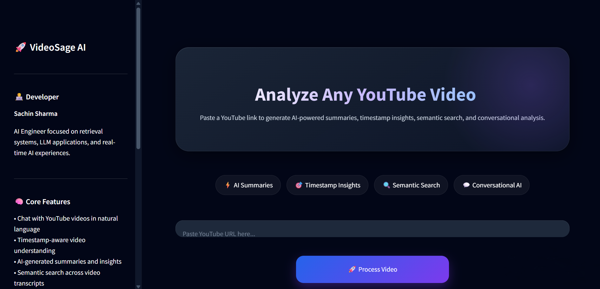
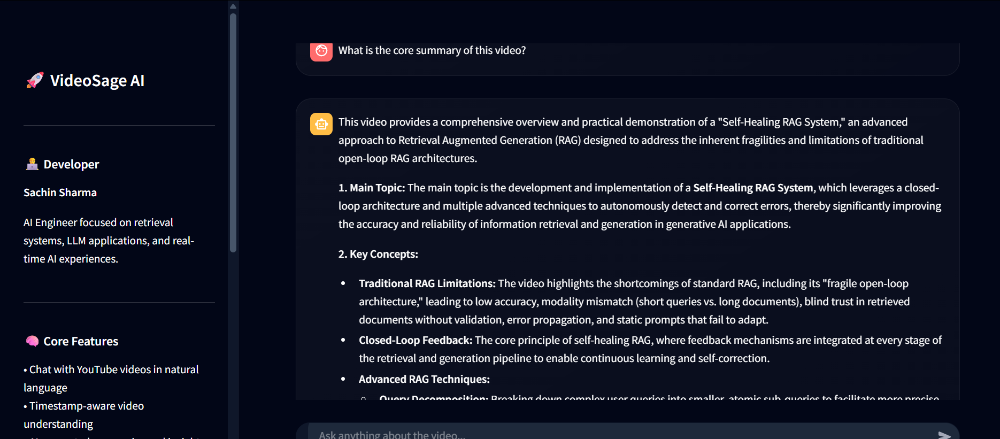
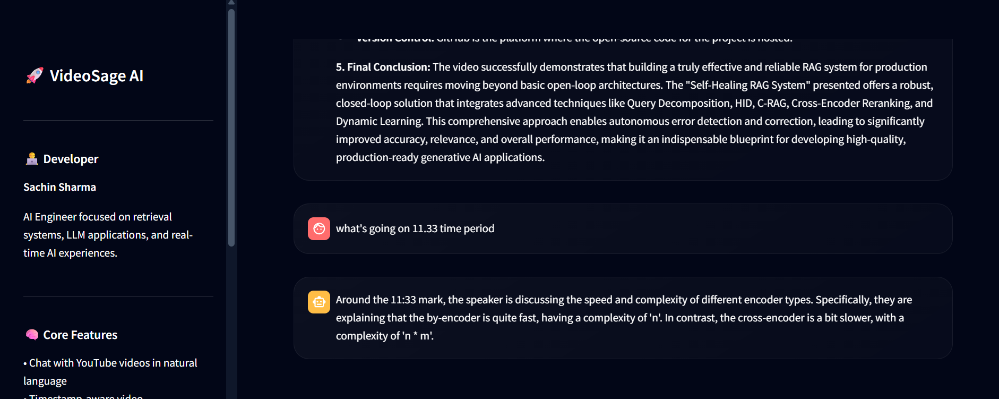
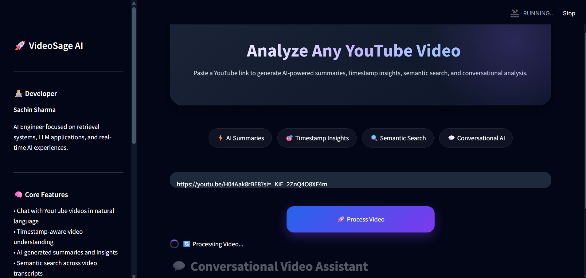

# 🎥 VideoSage AI

<div align="center">

### 🚀 AI-Powered YouTube Video Analysis Platform

Chat with YouTube videos using **RAG**, **LLMs**, **Semantic Search**, and **Timestamp-Aware Retrieval**

</div>

---

## 🌐 Live Demo

🔗 https://video-sage-ai.streamlit.app/

---

# ✨ Features

✅ Chat with YouTube videos in natural language  
✅ Timestamp-aware video understanding  
✅ AI-generated summaries and insights  
✅ Semantic search across transcripts  
✅ Real-time streaming AI responses  
✅ Multilingual transcript support  
✅ RAG-based conversational retrieval  
✅ Beautiful dark-themed UI  
✅ Gemini-powered intelligent answers  

---

# 🧠 Tech Stack

| Technology | Usage |
|---|---|
| Gemini 2.5 Flash | LLM Responses |
| LangChain | RAG Pipeline |
| Qdrant | Vector Database |
| HuggingFace Embeddings | Semantic Embeddings |
| Streamlit | Frontend UI |
| Python | Backend |
| YouTube Transcript API | Transcript Extraction |

---

# 📸 Project Preview

## 🏠 Homepage



---

## AI Chat





---

## Processing Pipeline


# ⚙️ Installation

## 1️⃣ Clone Repository

```bash
https://github.com/Sachin-dev001/video-sage-ai
cd video-sage-ai
```

---

## 2️⃣ Create Virtual Environment

### Windows

```bash
python -m venv venv

venv\Scripts\activate
```

### Mac/Linux

```bash
python3 -m venv venv

source venv/bin/activate
```

---

## 3️⃣ Install Requirements

```bash
pip install -r requirements.txt
```

---

# 🔑 Environment Variables

Create a `.env` file in the root folder.

```env
GOOGLE_API_KEY=your_gemini_api_key
```

---

# ▶️ Run Locally

```bash
streamlit run app.py
```

---

# 📂 Project Structure

```bash
video-sage-ai/
│
├── app.py
│
├── styles/
│   └── style.css
│
├── utils/
│   ├── youtube_loader.py
│   ├── text_cleaner.py
│   └── chunker.py
│
├── retrieval/
│   └── retriever.py
│
├── prompts/
│   └── rag_prompt.py
│
├── services/
│   └── llm_service.py
│
├── vectorstore/
│   └── qdrant_store.py
│
├── requirements.txt
│
└── README.md
```

---

# 🧠 How It Works

## 🔹 Step 1 — Extract Transcript

The app extracts subtitles/transcripts from YouTube videos.

## 🔹 Step 2 — Chunking

The transcript is divided into semantic chunks with timestamps.

## 🔹 Step 3 — Embedding Generation

Embeddings are generated using HuggingFace models.

## 🔹 Step 4 — Vector Storage

Chunks are stored in Qdrant vector database.

## 🔹 Step 5 — Retrieval

Relevant chunks are retrieved using semantic similarity.

## 🔹 Step 6 — Gemini Response

Gemini 2.5 Flash generates context-aware answers.

---

# 🎯 Example Questions

```text
Summarize this video

What happens at 12:45?

Explain the main concept

What tools are discussed?

Give key insights from the video

What is the conclusion?
```

---

# 🌑 UI Highlights

✅ Fully Dark Theme  
✅ Responsive Design  
✅ Modern Gradient Interface  
✅ Streaming AI Responses  
✅ Glassmorphism Design  
✅ Interactive Chat Experience  

---

# 🚧 Current Limitations

⚠️ Some YouTube videos block transcript extraction from cloud servers.  
⚠️ Videos without subtitles may fail.  
⚠️ Very large videos may take longer to process.  

---

# 🔮 Future Improvements

- 🎙 Voice-based interaction
- 📄 PDF export
- 🧠 Memory-enabled conversations
- 🌍 Multi-language AI responses
- 📹 Video summarization timeline
- 🔥 Hybrid Search + Reranking
- 🎯 Better transcript fallback systems

---

# 👨‍💻 Developer

## Sachin Sharma

AI Engineer focused on:

- Retrieval Systems
- LLM Applications
- AI Search Systems
- RAG Architectures
- Real-Time AI Interfaces

---

# 🌐 Connect With Me

## LinkedIn

https://www.linkedin.com/in/sachin-sharma-659ab53b6/

## GitHub

https://github.com/Sachin-dev001
---

# ⭐ Support

If you liked this project:

⭐ Star the repository  
🍴 Fork the project  
🧠 Share feedback  

---

# 📜 License

This project is licensed under the MIT License.

---

<div align="center">

### 🚀 Built with AI + RAG + Streamlit

</div>
